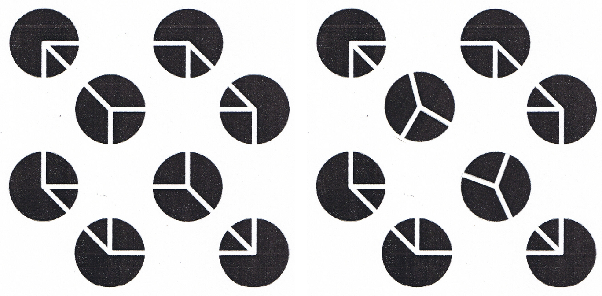
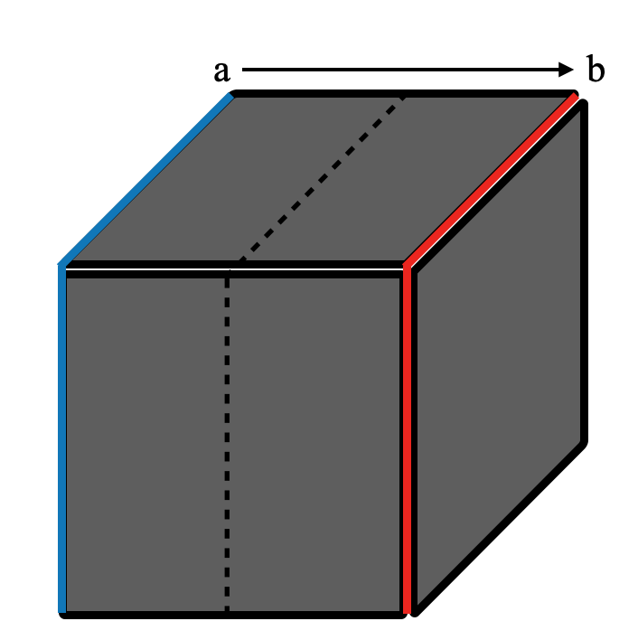

<blockquote>
	Documenting attempts of linking perception to Noether's theorem.
	  
	Where do we stand? What are the challenges ahead? What can we learn from the history of Physics? Can we follow the same steps to arrive at a set of equations to describe human perception? 
</blockquote>

<header class="major">
    <h3>The research question</h3>
</header>

	The goal of this research is to identify the conservation law of perception. A conservation law is the fundamental way nature works, expressed in mathematical terms. Stating perception in mathematical expressions that allows us to (1) have a set of equations that fully conveys the concept of perception, (2) predict the way perception changes and (3) identify the fundamental ingredients that form a percept. In this project, we focus on the bottom-up perception, the representing which is a response of the mind to information from the external world. While perception may also be influenced by internal factors (such as motivation, emotion, etc.), we will address top-down influences on perception in future studies. 

	The first step to discovering any conservation law is to notice some patterns or consistencies in nature. In other words, we need to have observations regarding some invariant aspects of nature. Other than outlining our observations of invariance in nature, we also need to specify the transformation under which the system is invariant. In this project, we were inspired by our observations on one aspect of human visual perception &#8212; the phenomena of 3D shape constancy. Three-D shape constancy is invariant under (1) rigid transformations (including scaling, rotation, and translation), (2) translation in time, (3) lighting transformation, and (4) color transformation, just to name a few (Refer to the page <a href="perceptualConstancy.html">Perceptual Constancy</a> for more details).

Noether's theorem states that every invariances in nature has its corresponding conservation law. This means that there must be some governing law of nature that is operating, and this law expresses itself through a set of consistent patterns that one may observe as the invariances.

<header class="major">
    <h3>Steps Needed</h3>
</header>

To connect observed invariances to their corresponding conservation laws, we follow the steps of scientific research, namely we start with making observations, followed by formulating theories, and finally refining the theories that stand against different tests or experiments performed. Below, we outline the steps specific to our study. 

	
<b>Problem Definition:</b> An invariance in nature

	
<b>Goal:</b> Discover the conservation law corresponding to the invariance

	
<b>Framework to Relate Perception Invariances to Perceptual Conservation Laws</b>

	<ol type="1">
		<li>Propose abstract variables that encode all relevant information about perception</li>
		<li>Define / Guess the relationship for each abstract variables in a way that corresponds to the measure used by nature (Iltis, C., 1971)</li>
		<li>Write out the Lagrangian of perception by combining the variables, Lagrangian being a function through which equations of motion are generated</li>
		<li>Identify the corresponding conservation law and derive the equations of motions describing perception by solving the action functional, which takes in the Lagrangian. By the end of this step, we will have formed a theory of perception.</li>
		<li>Perform experiments which manipulate perception with the goal to test if the equations of motions capture the "trajectory" of perception</li>
		<li>As needed, repeat step 2-6 as informed by the results of the experiments, or repeat step 1-6 if the proposed variables do not seem to make sense</li>
	</ol>

<header class="major">
    <h3>Challenges Ahead</h3>
</header>

	Each of these steps come with their own challenges. We will draw analogies from physics, in particular examples from mechanical systems to paint a picture of what lies ahead. Since the conservation law of energy and momentum has been successfully discovered for mechanical systems, we may gain inspirations and insights looking at its history. 

	<b>The first step</b> is to propose the appropriate abstract variables that have the ability to capture or summarize perception. The challenge at this stage is that we do not know how to describe perception, neither do we have a formal definition of shape to characterize the 3D shape constancy phenomenon.	As an analogy, mechanical systems are summarized by the abstract variables of energies (potential and kinetic energies). It follows that motions of objects are captured well by changes in energies. If one would pick the absolute $(x,y)$ coordinates to describe the system, even if the absolute position is precisely provided for all the components in the system, conservation law of energy (or momentum) cannot be derived from just positional values. It is until scientists looked past the tangible position of objects to abstract variables (e.g. kinetic energy = $\frac{1}{2}mv^2$) that equations of motion emerge. Equations of motion allow scientists to (1) adequately describe the current system and (2) make prediction on the trajectory of the system when it is being manipulated. 

	<b>Step 2:</b> Suppose that now scientists defined mass of an object, $m$, and its relative change in position, $v$, as the important ingredients to capture the concept of kinetic energy, $K$, they still need to combine $m$ and $v$ in a particular way. For example, there was a period of time where scientists were confused if $K = m|v|$ or $K = mv^2$ is the appropriate variable for kinetic energy (Iltis, C., 1971). Therefore, not only does the appropriate variables $m, v$ needed to be identified, the correct relationship between the variables should also be defined. 

	One could ask, why distilling the substance of a mechanical system to be described by its energies? We do not know why. But that seems to be describing how nature works. How did scientists know that the abstract concept of energy will describe a mechanical system? They had some insight. And indeed, physicists were proposing other variables, such as weight alone since "weight caused falling"; weight and height combined, since "weight cannot fall without height" in the early stages of their investigation. It was not until the integration of Leibniz's conservation principle which related height to velocity that there was a breakthrough: kinetic energy is defined as $K = mv^2$ since then (Coelho, 2009). Therefore, looking back at the history may be beneficial as we learn how physicists adjusted their exploration and landed on energy as the variable that captured the workings of nature. Following this vein, Steps 1 & 2 may also be described as finding the particular form of "energy variables" that capture the concept of "the percept of a 3D shape."

	After suitable variables such as energies are identified and written in their appropriate relationships, all abstract variables need to be related when writing out a Lagrangian in <b>Step 3</b>. For mechanical systems, the appropriate Lagrangian is $L = K - U$, where potential energy, $U$ and kinetic energy, $K$ are in opposition with each other (they are combined using a minus sign, $-$). For other domains, the Lagrangian need not involve potential or kinetic energy; abstract variables in Lagrangian need not be combined using a minus sign. While in Steps 1&2 we define the relationship for the abstract variables or concepts themselves, at this step we are connecting differnt concepts to describe a system. Once the system-level relationship is proposed, it is common practice to cancel out reduce the equations so that only a concise set of variables is used to describe the system. Doing this simplifies subsequent calculations since a separate ELE is needed for every variable involved in the Lagrangian. 

	Once a satisfactory Lagrangian is proposed, one may invoke Noether's theorem <b>(Step 4)</b> by setting the action functional, which takes the Lagrangian function as input and output a single real number, to extremal. Using the principle of least action, which states that nature optimizes the resulting trajectory so that the action required is minimal, we should be able to solve the equation and arrive at a conserved quantity, which is some combination of the defined variables, related in the way required by mathematics. This conserved quantity tells us about the conservation law, since nature operates in a way such that no matter how perception is being manipulated under some specified transformation, this conserved quantity remains unchanged. At the end of Step 4, we have formed a theorem of perception.

	The last two steps <b>(Steps 5 & 6)</b> relates to supporting or disproving the theory. Experiments should be designed in a way that changes some important aspect of perception, but show that the conserved quantity is indeed unchanged throughout the process. Most often than not, the theory undergoes refinement to account for more experimental evidences, to include new findings, to update the relationship between proposed abstract variables, or to conclude the proposed variables to be inappropriate for the phenomenon. Regardless of the outcome, the scientific community will benefit as we gain better understanding on human perception. 

<blockquote>
"It is important to realize that in physics today we have no knowledge of what energy is" &#8212; Richard Feynman (<a href="https://www.feynmanlectures.caltech.edu/I_04.html">Lecture 4: Conservation of Energy</a>)
</blockquote>

<header class="major">
    <h3>Where do we stand</h3>
</header>

	We are at the ground breaking stage to uncover the underlying law of human perception. Currently, we do not yet have a clear definition for perception. Synonyms of perception include the subjective experiences of an individual, the mental representation, the result of the mind, some abstraction of the world, ... In the field of Cognitive Sciences, scientists study perception from all angles: the neuroscience from the cortical level down to the neuronal populations involved, computational models spanning from Bayesian inference to Gestalt heuristics, behavioral experiments such psychophysics, and philosophical discussions from the epistemology of perception to its veridicaility. In this project, we study perception by uncovering the fundamental laws of nature, the conservation laws. As outlined in the framework above, we start by selecting the appropriate variables, followed by proposing a suitable Lagrangian to describe the phenomena (invariance), then finally deriving the conservation law. 

<blockquote>
	<h3>We study perception by uncovering the fundamental laws of nature, the conservation laws</h3>
</blockquote>

	
<b>Problem Definition:</b> 3D shape constancy, a phenomenon of human visual perception

	
<b>Goal: </b>Discover the conservation law corresponding to 3D shape constancy

	<header class="major">
	    <h3>1. Proposed Abstract Variable: Mirror Symmetry</h3>
	</header>
	

		It is important to note that we currently do not have a consensus on the definition of shape. We propose that 3D shapes may be represented by the abstract variable of mirror symmetry (bilateral symmetry). Experiments have shown that without symmetry, shape constancy cannot be achieved (Pizlo & de Barros, 2021). When subjects were given a 2D image of a non-mirror-symmetric 3D object, human subjects failed to demonstrate shape constancy. Relatedly, previous research have shown that the unique visual percept being formed when shape constancy occurs always aligns with the set of possibility defined using mirror symmetry as the heuristic (Jayadevan et al., 2018).
	

	
<b>Why mirror symmetry?</b>

	

		Both natural and man-made objects exhibit mirror-symmetry. In fact, over 99% of modern animals exhibit mirror symmetry. (Finnerty et al., 2004). Being bilaterally symmetric may be linked to stability (symmetrical distribution of weights), or to their functionality (being able to move straightly, or move in all directions, being able to bear objects, ...). Therefore, given the prevalence of mirror symmetric objects in nature, the human visual system may have evolved to utilize mirror symmetry as an important piece of information for visual perception to be formed.
	

	

		Other than that, symmetry entails redundancy. Zyg & de Barros (2021) believe that "redundancy is the most effective constraint in solving ill-posed inverse problems." Mirror symmetry is the simplest case of redundancy, with one symmetry under the operation of mirror reflection. Another supportive case could be a Necker cube, where a slight twist in local features distorts the overall global percept. Why? Mirror symmetry is lost. 
	

	

		

			
		

		

			

				Left: Original Necker cube illusion, where we arrive at the the perception of a 3D cube from eight disks oriented in a specific way.  
				Right: Necker cube with two disk rotated clockwise by 20 degrees. We no longer arrive at the percept of a cube.  
			

		

	

	<header class="major">
	    <h3>Steps 2-6: Work in progress</h3>
	</header>
	

		Looking ahead, how would the Lagrangian look like if we would like to describe 3D shapes using mirror symmetry? As an immature placeholder, we imagine a Lagrangian that takes as input the left side and the right side of the 3D object. The precise mathematical form on how to describe that shape is to be worked out. Consider all the points to the left side and points to the right side of the 3D object. The "dynamics" of the object, the Lagrangian, is a function that will sweep through the region in between the left and right side, so that the action functional will be the integral of the whole walk through all the points of the shape. This integral does not change (is constant or is invariant) if both the left and right side of the shape changes together, so the functional is invariant under the transformation operation that changes the shape of the object but retaining its mirror symmetry property. 
	

	

		

			
		

		

			

				An immature placeholder for Lagrangian of 3D shape constancy: The curve which belongs the plane $a$ is marked in blue and that of plane $b$ in red. The shape of the 3D cube is defined by having the starting plane $a$ and ending plane $b$. A Lagrangian that measures the degree of mirror symmetric of the surface that runs between $a$ and $b$ (passing through the plane of symmetry), forming a 3D shape as it sweeps continuously from $a$ to $b$. Divergent from the plane will be captured as non-symmetric. The more divergent there is and the more frequent the divergent, the more non-symmetrical is the 3D shape. Likewise, the same function can be applied at the 1D forming 2D plane level: the degree of similarity between two planes may be defined by comparing the two curves, one to the left and one to the right of the plane. The degree of symmetry of the plane is the degree of symmetry as the function sweeps from curve $a$ to curve $b$.    
			

		

	

<header class="major">
    <h3>What other methods may be used?</h3>
</header>
<h4>The indirect trial and error method</h4>

	From observed symmetry, can we come up with a cost functional that exhibit similar behavior with the measured system? In other words, can we come up with cost functionals that reflect human behaviors, although the cost functional may not be the exact functional utilized by humans? The criterion for the propose cost functional would be that it assigns lowest cost to human solution, since the human solution is the nature-picked best solution with minimal cost. 

	From the cost functional that is minimized, how can we derive the conserved quantity? How do we come up with the Lagrangian given only the cost functional? 

<h4>The piggybacking method</h4>

	Is it possible to go from the direction of proving that the phenomena belongs to some finite symmetry group? This way we search for related works of applying Noether's theorem to that finite group, works done by others can be applied to the phenomena as well.

<header class="major">
    <h3>Citations</h3>
</header>
1. Iltis, C. (1971). Leibniz and the vis viva controversy. Isis, 62(1), 21-35.
2. Finnerty, J. R., Pang, K., Burton, P., Paulson, D., & Martindale, M. Q. (2004). Origins of bilateral symmetry: Hox and dpp expression in a sea anemone. Science, 304(5675), 1335-1337.
3. Coelho, R. L. (2009). On the concept of energy: how understanding its history can improve physics teaching. Science & Education, 18(8), 961-983.
4. Pizlo, Z., & De Barros, J. A. (2021). The concept of symmetry and the theory of perception. Frontiers in computational neuroscience, 73.
5. Jayadevan, V., Sawada, T., Delp, E., & Pizlo, Z. (2018). Perception of 3D symmetrical and nearly symmetrical shapes. Symmetry, 10(8), 344.

