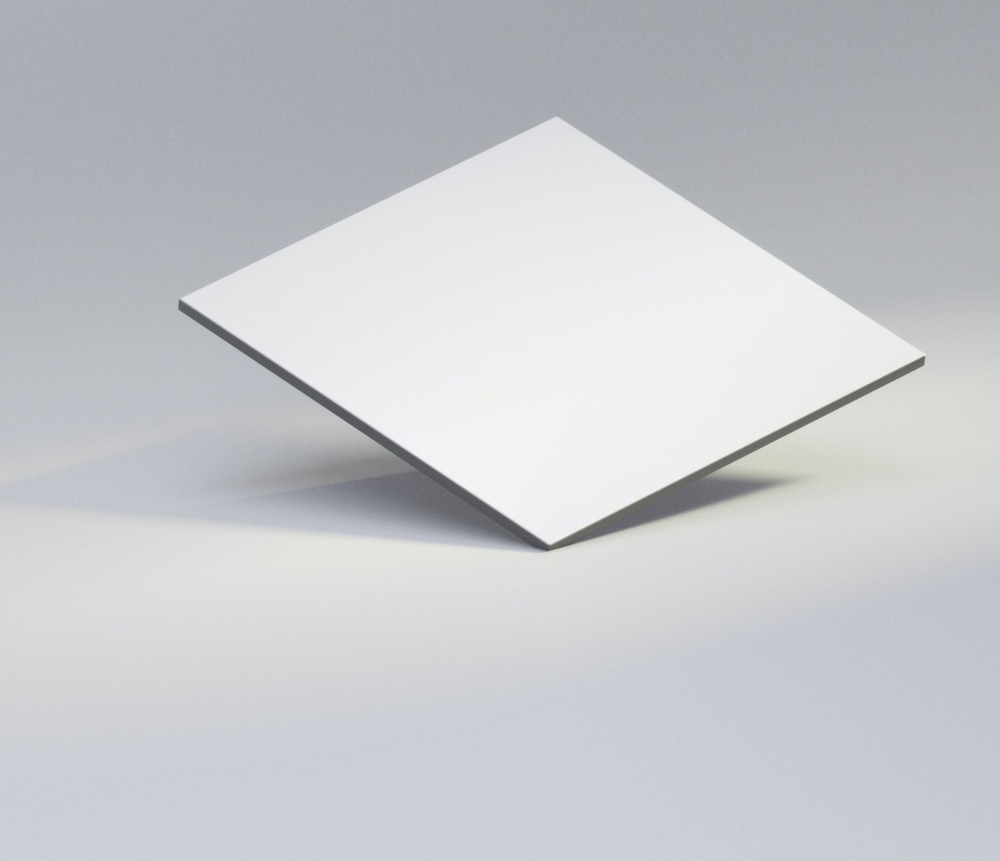

<!-- Main -->

<!-- One -->
<section id="one">
	

		<header class="major">
			<h2>Describing human perception using the formalism of Noether’s Theorem</h2>
		</header>
		
This website was created with the intention to invite discussion on formulating the governing law of perception using Noether's theorem.
		

	

</section>

<!-- Two -->
<section id="two" class="spotlights">
	<section>
		
		

			

				<header class="major">
					<h3>Goal of the Project</h3>
				</header>
				

					There are three components to Noether's theorem: (1) symmetry (aka invariance), (2) conservation laws (aka canonical momentum or equations of motion), and (3) least action principle (aka solving the Euler-Lagrange equations). Translated in terms familiar to cognitive scientists, they correspond to (1) some preserved cognitive quantity, (2) perceptual constancy, (3) least cost function.
				

				

					We include a template with placeholders to facilitate the connection between perception and Noether's theorem. Science is as simple as filling in the blanks and submit your ideas for review!
				

				<ul class="actions">
					<li><a href="goalTemplate.html" class="button">Learn more</a></li>
				</ul>
			

		

	</section>
	<section>
		
		

			

				<header class="major">
					<h3>The Phenomena: Perceptual Constancy</h3>
				</header>
				
What do we have in mind when we use the word "perception"? What is perceptual constancy? Why do we adopt perceptual constancy phenomena as our test vehicles?

				
We present our standpoint through the lens of human visual perception.

				<ul class="actions">
					<li><a href="perceptualConstancy.html" class="button">Learn more</a></li>
				</ul>
			

		

	</section>
	<section>
		
		

			

				<header class="major">
					<h3>Noether's Theorem</h3>
				</header>
				
Symmetry [of a variational problem] implies a one-to-one correspondence with a conserved quantity, which conservation law can be derived by applying the least action principle. 

				
Mathematical notations of Noether's theorem, written with minimal assumption on reader's background. Expandable step-by-step derivations are included so that any interested reader may understand and appreciate the theorem.

				<ul class="actions">
					<li><a href="noetherTheorem.html" class="button">Learn more</a></li>
				</ul>
			

		

	</section>
	<section>
		
		

			

				<header class="major">
					<h3>Attempt</h3>
				</header>
				
 
					Documenting attempts of applying Noether's theorem on perception.
				

				

					Where do we stand? What are the challenges ahead? What can we learn from the history of Physics? Can we follow the same steps to arrive at a set of equations which describe human perception? 
				

				<ul class="actions">
					<li><a href="brainstorm.html" class="button">Learn more</a></li>
				</ul>
			

		

	</section>
	<section>
		
		

			

				<header class="major">
					<h3>Assumptions and Possible Critiques</h3>
				</header>
				
 
					Spelling out assumptions, bridging hypotheses, addressing possible critiques.
				

				

					Physical and perceptual invariance, perception as non-physical quality, continuous vs discrete symmetry, ...
				

				<ul class="actions">
					<li><a href="assumptions_critiques.html" class="button">Learn more</a></li>
				</ul>
			

		

	</section>
	<section>
		
		

			

				<header class="major">
					<h3>Previous Work</h3>
				</header>
				
 
					Collection of published papers on the unified theory of perception, and some published works on the effort to describe the Lagrangian of the brain.
				

				

					Role of mental representation, predictive coding, quantum structure, free-energy principle, ...
				

				<ul class="actions">
					<li><a href="previousWork.html" class="button">Learn more</a></li>
				</ul>
			

		

	</section>
</section>

