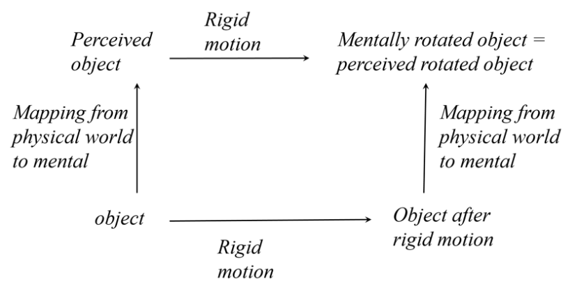
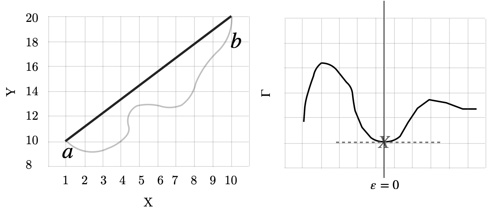

<blockquote> 
	Symmetry [of a variational problem] implies a one-to-one correspondence with a conserved quantity, which conservation law can be derived by applying the least action principle.  
	Mathematical notations of Noether's theorem, written with minimal assumption on reader's background. Expandable step-by-step derivations are included to help anyone who is interested to understand and appreciate the theorem.
</blockquote>

<header class="major">
    <h2>Noether's Theorem</h2>
</header>

Text on this page is heavily based on the book <i>Emmy Noether’s Wonderful Theorem</i>, by Dwight E. Neuenschwander. 

	
If under the infinitesimal transformation $t' = t + \varepsilon \tau + ...; q'^\mu = q^\mu + \varepsilon \zeta^\mu + ...$, the functional $\Gamma = \int_a^b L(t, q^\mu, \dot{q}^\mu)\ dt$ is both invariant and extremal, then the following conservation law holds: $p_\mu  \zeta^\mu - H\tau = \text{constant}$.
	

	

	  
<header class="major">
	    <h4 style="margin: -1.5em 0 0 1em">Notations</h4>
	</header>
 
	
If under the infinitesimal transformation $t' = t + \varepsilon \tau + ...$

	

		$t$ represent the independent variables of some generalized coordinate, $\tau$ is the collection of generators for the independent variables, $\tau(t, q^\mu) \equiv \frac{dT}{d\varepsilon}$, where $T$ is a mapping function that transforms coordinate system, taking in original independent and dependent variables and output a new set of independent variables, $t \rightarrow t' = T(t, q^\mu, \varepsilon)$, $\varepsilon$ quantifies how much difference there is between the original and new coordinate system. $+...$ are higher order terms after expanding $T(t, q^\mu, \varepsilon)$ in Taylor series about $\varepsilon = 0$, so $t' = t + \varepsilon \left(\frac{dT}{d\varepsilon}\right)_0 + O(\varepsilon^2) + O(\varepsilon^3) + ...$.
	

	
If under the infinitesimal transformation ... $q'^\mu = q^\mu + \varepsilon \zeta^\mu + ...$

	

		$q^\mu$ represent the dependent variables of some generalized coordinate, $\zeta^\mu$ is the collection of generators for dependent variables, $\zeta^\mu(t, q^\nu) \equiv \left(\frac{dQ^\mu}{d\varepsilon}\right)_0 $, where $Q^\mu$ is a mapping function that transforms coordinate system, taking in original independent and dependent variables and output a new set of dependent variables, $Q^\mu(t, q^\nu, \varepsilon)$, $\varepsilon$ quantifies how much difference there is between the original and new coordinate system, and $q^\nu$ are the generalized dependent variables. $+...$ are higher order terms after expanding $Q^\mu(t, q^\nu, \varepsilon)$ in Taylor series about $\varepsilon = 0$, so $q' = q + \varepsilon \left(\frac{dQ^\mu}{d\varepsilon}\right)_0 + O(\varepsilon^2) + O(\varepsilon^3) + ...$.
	

	
the functional $\Gamma = \int_a^b L(t, q^\mu, \dot{q}^\mu)\ dt$ is both invariant and extremal

	

		$\Gamma$ is a functional that takes a function as input and produces a real number as output. Definite integrals are examples of functionals. The significance of functionals is that a functional that is invariant and extremal leads to conservation laws. $L$ is a function, called the Lagrangian (refer to section <a href="#lagrangian-explanation">What is a Lagrangian</a> for more details). For checking if functional is invariant and extremal, refer to section <a href="#invariant">Determining if a functional is invariant</a> and <a href="#extremal">Functionals made extremal</a> for more details).
	

	
then the following conservation law holds: $p_\mu  \zeta^\mu - H\tau = \text{constant}$

	

		$p_\mu$ are the canonical momentum conjugates, $p_\mu \equiv \frac{\partial L}{\partial \dot{q}^\mu}$. $H$ is the Hamiltonian, $H \equiv p_\mu \dot{q}^\mu - L$. 
	

	

	The implication of Noether's theorem is that, invariance (symmetries) in nature are related to their corresponding conservation laws through the least action principle. Invariants of Lagrangian always have their corresponding conservation laws. Identifying the conservation law means that we identified some fundamental laws of nature. The explanation for human perception then becomes: perceptual constancy occurs because perception abides by the conservation law of xxx. There is no dispute &#8212; that is how nature works. The goal of this project is to be able to write out mathematically the conservation laws of human perception. 

	

		
	

	

		

			A 3D object is invariant under rigid motions, and the perception of this object is invariant under the same group of rigid motion. This invariance implies that the observer perceives the permanent characteristics of this object. We used a label “mental rotation” instead of “mental rigid motion” because the former has already been used in the cognitive literature. (Figure 3 from Pizlo & de Barros (2021) paper).
		

	

	

	The power in considering Noether's theorem in perception is that it offers a principled way to connect perception with the physical properties that elicited perception in the first place. In other words, physical invariants can be related to perceptual invariants when we describe perception using Noether's theorem. Assuming we perceive the world veridically, the mapping from physical world to perception (top right corner) is the same regardless you follow the path right-and-up or up-and-right.

	To apply Noether's theorem on perception, the challenges include defining the appropriate Lagrangian to describe the dynamics of the system of interest, then to find some variables which changing the variables leave the dynamics of the system unchanged (finding the symmetry using the terms described by the Lagrangian). After that, we can solve the Euler-Lagrange equations (applying the least action principle) to find the quantity being conserved (arriving at the conservation law). The conservation law tells us the conserved quantity, so we can come to conclusions such as: "xxx conserved quantity and yyy perceptual parameter (some variable that captures some aspect of the perception) are conjugate variables." Meaning that regardless of how yyy parameter changes, the perception is not affected, there is perceptual constancy. 

 
	Refer to the <a href="brainstorm.html">Attempts</a> page to learn more about our proposal to crack into this problem. 

<header class="major">
    <h2>Examples: Symmetries and their corresponding higher order invariants (conservations)</h2>
</header>

	<table>
		<thead>
			<tr>
				<th>Conservation law</th>
				<th>Invariance / Symmetry</th>
			</tr>
		</thead>
		<tbody>
			<tr>
				<td>Conservation of energy</td>
				<td>Invariance under time translations, signify homogeneity of time</td>
			</tr>
			<tr>
				<td>Conservation of linear momentum</td>
				<td>invariance under space translations, signify homogeneity of space</td>
			</tr>
			<tr>
				<td>Conservation of angular momentum</td>
				<td>invariance under rotations, signify isotropy of space</td>
			</tr>
		</tbody>
	</table>

<header class="major">
	    <h2>More Explanations</h2>
</header>

	Note: For ease of notation, we consider the case where there is 1 independent variable, $t$, and a set of dependent variables $q^\mu$, where $\mu= 1,\ 2,\ ...,\ N$ with $N$ being the total number of dependent variables. We can always generalize to include more independent variables, $\Gamma = \int \int L(t_1, t_2, ...)\ dt_1 dt_2$. 

	We can also include only up to the first order of derivative for the dependent variables, $\dot{q}^\mu$. Higher order derivative terms can easily be included, $\Gamma = \int L(t, q^\mu, \dot{q}^\mu, \ddot{q}^\mu, ...)$.  

  
<header class="major">
    <h4 style="margin: -1.5em 0 0 1em">Conservation of energy</h4>
</header>
 

	
  
	  Conservation of energy is derived by studying the change of the system over time, while conservation of momentum is derived by studying the change of system over spatial distance. 
	

	

	  We start by considering our Lagrangian, $L(t, q^\mu, \dot{q}^\mu)$, which function depends on the independent variables $t$, dependent variables $q^\mu$ and the first derivative of the dependent variables $\dot{q}^\mu$. $t$ could be time. Studying the change of the system over time means we taking the total derivative with respect to time, $\frac{dL}{dt}$. Recall that $q^\mu$ and $\dot{q}^\mu$ are dependent variables and their first derivatives, meaning that they are functions of the independent variables, $t$. Written in full, we have $q^\mu(t)$ and $\dot{q}^\mu(t)$. Therefore, the partial time derivatives of all dependent variables become 
	  $$\label{eq:CoE}\tag{eq:CoE}$$ $$
	  \begin{equation*}
	  	\begin{split}  	\frac{dL}{dt} &= \frac{\partial L}{\partial t} + \frac{\partial L}{\partial q^\mu}\frac{q^\mu}{dt} + \frac{\partial L}{\partial \dot{q}^\mu} \frac{\dot{q}^\mu}{dt}\\
	  					  & = \frac{\partial L}{\partial t} + \frac{\partial L}{\partial q^\mu}\dot{q}^\mu + \frac{\partial L}{\partial \dot{q}^\mu} \ddot{q}^\mu
	  	\end{split}
	  \end{equation*}$$
	  We define a new variable, called the conjugate momentum(momenta), $p_\mu$, such that $p_\mu \equiv \frac{\partial L}{\partial \dot{q}^\mu}$, so that $\dot{p}_\mu = \frac{\partial L}{\partial q^\mu}$. Substitute the newly defined variable into $\ref{eq:CoE}$, we get 
	  $$\label{eq:CoE-sub}\tag{eq:CoE-sub}$$ $$
	  \begin{equation*}
	  	\begin{split}	\frac{dL}{dt} &= \frac{\partial L}{\partial t} + \dot{p}_\mu \dot{q}^\mu + p_\mu \ddot{q}^\mu
	  	\end{split}
	  \end{equation*}$$
	  We know that by product rule, $\frac{d}{dt} \left( p_\mu \dot{q}^\mu \right) = \dot{p}_\mu \dot{q}^\mu + p_\mu \ddot{q}^\mu $, which is exactly the last two terms of $\ref{eq:CoE-sub}$, so we write $\frac{dL}{dt} = \frac{\partial L}{\partial t} + \frac{d}{dt} \left( p_\mu \dot{q}^\mu \right)$. Rearranging the terms, we get $\frac{\partial L}{\partial t} + \frac{d}{dt} \left( p_\mu \dot{q}^\mu \right)  -  \frac{dL}{dt} = 0$. Factoring out common terms, we get 
	  $$\label{eq:Legendre}\tag{eq:Legendre}$$ $$
	  \begin{equation*}
	  	\begin{split}	\frac{\partial L}{\partial t} + \frac{d}{dt} \left( p_\mu \dot{q}^\mu - L \right) &=0
	  	\end{split}
	  \end{equation*}$$
	

	

		When $\frac{\partial L}{\partial t} = 0 $, there is a conservation. Specifically, the quantity $\frac{d}{dt} \left( p_\mu \dot{q}^\mu - L \right)$ is being conserved, $=0$, because small perturbation to the independent variables, $t \rightarrow t + \Delta t$ has no impact on $\frac{d}{dt} \left( p_\mu \dot{q}^\mu - L \right)$. In order for that to happen, $\left( p_\mu \dot{q}^\mu - L \right)$ has to be a constant so that $\frac{d}{dt}(\text{constant})=0$. Therefore, there is a conservation either if $H$ is constant or $\frac{\partial L}{\partial t} = 0 $. $H$ will be discussed in detail in the next subsection, <a href="#hamiltonian">Hamiltonian $H \equiv  p_\mu \dot{q}^\mu - L$</a>.
	

	

		In Physics, they call this condition where the quantity doesn't change with time, the conservation of energy. 
	

	
	

	<!-- place anchor a little above so that can reference there -->
    
	

		
<header class="major no-padding">
			<h5 style="margin: -1.5em 0 0 1em">Hamiltonian $H \equiv  p_\mu \dot{q}^\mu - L$</h5>
		</header>

	

	  See that we have written $\left( p_\mu \dot{q}^\mu - L \right)$ many times, we define a new variable, $H$, named the Hamiltonian, $H \equiv  p_\mu \dot{q}^\mu - L$, or written in full, $H \equiv  \frac{\partial L}{\partial \dot{q}^\mu} \dot{q}^\mu - L$. $H(t, q^\mu, p_\mu)$ is a function of the independent variables, $t$, the dependent variables $q^\mu$, and the conjugate momenta of the dependent variables, $p_\mu$.
	

	

	  For Physicists, Hamiltonian is always the energy of something, though in other domains it need not be the case. This is because for most physics applications, $H = K + U$, which is the total mechanical energy: kinetic plus potential energy, $E = K + U$. Since $L$ and $H$ in those applications have the same dimensions, through the definition of $H \equiv  p_\mu \dot{q}^\mu - L$, physicists can afford to say that their Hamiltonian is always the energy of something. 
	

	

<!-- NEW Section: Momentum -->

	
<header class="major no-padding">
		<h5 style="margin: -1.5em 0 0 1em">Legendre transformation from $L(t, q^\mu, \dot{q}^\mu)$ to $H(t, q^\mu, p_\mu)$</h5>
	</header>

	

		Using $H$ in the total time derivative of our Lagrangian, we can re-write $\ref{eq:Legendre}$ in the form, $\frac{\partial L}{\partial t} + \frac{d}{dt}(H) =0$ or $\frac{\partial L}{\partial t} + \dot{H} =0$, where $H \equiv  p_\mu \dot{q}^\mu - L$. We call this alternate form of writing a function, from one which takes the variables, $\left( q^\mu \right)$, to a function that takes the conjugate set of variables, $\left( p_\mu \right)$, the Legendre transformation.
	

	

	
<!-- NEW Section: Lagrangian and ELE -->

  
<header class="major">
    <h4 style="margin: -1.5em 0 0 1em">Conservation of momentum</h4>
</header>
 

	
  
	  Conservation of energy is derived by studying the change of the system over time, while conservation of momentum is derived by studying the change of system over spatial distance. 
	

	
  
		Using the ELE: $\frac{\partial L}{\partial q^\mu} - \frac{d}{dt} \frac{\partial L}{\partial \dot{q}^\mu} = 0$, where $t$ are the independent variables, $q^\mu$ are the dependent variables and $\dot{q}^\mu$ are the first derivatives of the dependent variables, the conservation of momentum can be derived.
	

	

		We move the second term in the ELE across, giving $\frac{\partial L}{\partial q^\mu} = \frac{d}{dt} \frac{\partial L}{\partial \dot{q}^\mu}$. We define a new variable, named the canonical conjugate momentum(momenta), $p_\mu$, such that $p_\mu \equiv \frac{\partial L}{\partial \dot{q}^\mu}$, so that $\dot{p}_\mu = \frac{\partial L}{\partial q^\mu}$. By substitution, we get $\frac{\partial L}{\partial q^\mu} = \dot{p}_\mu$. 
	

	

		There is a conservation if $\frac{\partial L}{\partial q^\mu} = 0$, meaning that no matter how the coordinate $q^\mu$ changes, $L$ is not affected because $L$ does not explicitly depend on $q^\mu$. 
	

	

		It follows that $\dot{p}_\mu = 0$. This means that $\frac{d}{dt}\left( p_\mu  \right) = 0$, which requires $p_\mu$ to be a constant ($\frac{d}{dt}(\text{const}) = 0$).  
		Therefore, we can also say that if $p_\mu $ is constant, there is conservation, because $p_\mu $ is constant if and only if $\frac{\partial L}{\partial q^\mu} = 0$. 
	

	

		In Physics, they call this quantity that doesn't change with dependent variables $q^\mu$ the conservation of momentum. 
	

	<!-- place anchor a little above so that can reference there -->
    
	

		
<header class="major">
			<h4 style="margin: -1.5em 0 0 1em">Deriving ELE from Lagrangian</h4>
		</header>

	

		Euler-Lagrange equations (ELEs) are outcomes of the lemma of the calculus of variations. It occurs that to find the set of functions, $\{q^\mu(t)\}$ that makes $\Gamma$ extremal, the quantity $\frac{\partial L}{\partial q^\mu} - \frac{d}{dt} \frac{\partial L}{\partial \dot{q}^\mu} $ has to evaluate to 0. 
		$$\label{eq:ELE}\tag{eq:ELE}$$ $$
		  \begin{equation*}
		  	\begin{split}	\frac{\partial L}{\partial q^\mu} - \frac{d}{dt} \frac{\partial L}{\partial \dot{q}^\mu} &= 0
		  \end{split}
		\end{equation*}$$
	

	

		Below we show, baby step by baby step, derivation of ELE. Recall that $L$ is a function that generates equations of motion, $L(t, q^\mu, \dot{q}^\mu)$. Say we are interested in the collective motion of that system of interest between two set points $a$ and $b$, i.e., the trajectory between $a$ and $b$. We therefore sum up the motion from $a$ to $b$, which is equivalent to taking the integral over the independent variable $t$, $\int_a^b L(t, q^\mu, \dot{q}^\mu)\ dt$. $\int_a^b L(t, q^\mu, \dot{q}^\mu)\ dt$ can also be called the <i>action</i>. We define a variable to represent the <i>functional</i> (an operator that maps functions to real numbers), such that $\Gamma = \int_a^b L(t, q^\mu, \dot{q}^\mu)\ dt$. $\Gamma$ takes in a function and returns a real number evaluating the cost. Our goal is to identify the least cost trajectory to get from $a$ to $b$, i.e., we want to find the set of functions $\{q^\mu(t)\},\ \mu = 1,\ 2,\ ...,\ N$ that makes $\Gamma$ extremal, where $N$ is the total number of dependent variables. 
	

	

		

			

				

					<b>Left</b>: Consider a simple case to illustrate this: we have 1 independent variable, $X$ and 1 dependent variable $Y$. We would like to find the set of $\{y\}$ such that the cost for the trajectory between $a$ and $b$ is minimal. A straight line is the solution with minimum cost, if we define our cost as the Euclidean distance between $a$ and $b$, shown by the bolded straight line in the left image. Let $q^1(x)$ be the least cost solution, with $N=1$ (we only have 1 dependent variable). There are other solutions, $q'^1$ such that it will produce longer trajectories, $q'^1(x)= q^1(x) + \varepsilon \zeta^1$. An example being the gray curvy line in the image. 
					<b>Right</b>: As we sweep over X-axis in small increments (integration), the least cost solution has to have $\varepsilon =0$, so that $q^{\text{solution}} = q^1(x)$, meaning we arrived at the least cost solution. Setting $\frac{d\Gamma}{d\varepsilon} = 0$ means that we would like to find the stationary point, which in our case, is the minimum point corresponding to least cost path. The solution will have $\varepsilon=0$ so that the corresponding set of variables will be $q^\mu$, that is the least cost solution. The graph of variation against cost function, $\varepsilon$ against $\Gamma$ was intentionally drawn to be asymmetrical to show that $\Zeta^\mu$ is an arbitrary function. 
				

			

			

			

		

	

	

		Sub-optimal solutions, $\{q'^\mu\}$ are defined as paths that are longer than the optimal solution, $\{q^\mu\}$, so that $q'^\mu (t)= q^\mu + \varepsilon \zeta^\mu$, where $\zeta^\mu$ is subject to the constraints that after adding $\zeta^\mu$ to $q^\mu$, the resulting $q'^\mu$ will still have the same starting and ending points (because we set up the problem that we will be looking at those intervals), $\zeta^\mu(a) = \zeta^\mu(b) = 0$. The second constraint on $\zeta^\mu$ is that it belongs to the same coordinate space as $q^\mu(t)$. 
	

	

		$\Gamma(\varepsilon)$ is a function of $\varepsilon$, since as values of $\varepsilon$ changes, we get different values for $\Gamma(\varepsilon)$ with different $q'^\mu (t)$ associated. Setting $\frac{d\Gamma}{d\varepsilon} = 0$ means making $\Gamma$ extremal. Using Leibniz's rule, we write $\left[ \frac{d\Gamma}{d\varepsilon}\right]_{\varepsilon=0} = \int_a^b \left[ \frac{\partial L}{\partial q^\mu} \zeta^\mu + \frac{\partial L}{\partial \dot{q^\mu}} \dot{\zeta^\mu} \right]\ dt =0$,
		where $\left[ \frac{d\Gamma}{d\varepsilon}\right]_{\varepsilon=0}$ means evaluating $\frac{d\Gamma}{d\varepsilon}$ as $\lim_{\varepsilon \to 0}$. 
	

	

		We breakdown the equation by first focusing on the second term in the square brackets, $\frac{\partial L}{\partial \dot{q^\mu}} \dot{\zeta^\mu}$. We integrate by parts to turn $\dot{\zeta^\mu}$ into $\zeta^\mu$, so that we get $\frac{\partial L}{\partial \dot{q^\mu}} \dot{\zeta^\mu} = -  \frac{d}{dt} \frac{\partial L}{\partial \dot{q}^\mu } \zeta^\mu + \frac{d}{dt}\left[ \frac{\partial L }{\partial \dot{q^\mu}} \zeta^\mu \right]_a^b$. Since we know that $\zeta^\mu(a) = \zeta^\mu(b) = 0$, we drop the second term, so $\frac{\partial L}{\partial \dot{q^\mu}} \dot{\zeta^\mu} = -  \frac{d}{dt} \frac{\partial L}{\partial \dot{q}^\mu } \zeta^\mu $.
	

	

		Substituting the second term back into the main equation, we get $\left[ \frac{d\Gamma}{d\varepsilon}\right]_{\varepsilon=0} = \int_a^b \left[ \frac{\partial L}{\partial q^\mu} \zeta^\mu - \frac{d}{dt}\frac{\partial L }{\partial \dot{q\mu}}\zeta^\mu \right]\ dt =0$. Factoring out common term, we get 
		$$\label{eq:CalcVar}\tag{eq:CalcVar}$$ $$
		  \begin{equation*}
		  	\begin{split}	\left[ \frac{d\Gamma}{d\varepsilon}\right]_{\varepsilon=0} = \int_a^b \left[ \frac{\partial L}{\partial q^\mu}- \frac{d}{dt}\frac{\partial L }{\partial \dot{q\mu}} \right] \zeta^\mu \ dt &=0 
		  	\end{split}
	  	\end{equation*}$$
	

	

		Hint: Notice that the terms inside the square brackets are the exact same terms at the LHS of $\ref{eq:ELE}$. The fundamental lemma of the calculus of variations by Logan (1977) demonstrated that for $\ref{eq:CalcVar}$ to be true, the quantity inside the square brackets, $\frac{\partial L}{\partial q^\mu}- \frac{d}{dt}\frac{\partial L }{\partial \dot{q\mu}} $ has to $= 0$. 
	

	

		Here is the proof of the lemma. In the most general case, we define $A(t)$ to be a continuous function on the open interval $(a,b)$, and define $h(t)$ to be just like $\zeta^\mu$, an arbitrary function that has constraint that it vanishes at both endpoints. The general form of the equation $\ref{eq:CalcVar}$ can be written as $\int_a^b A(t) h(t)\ dt =0$. The lemma states that $A(t) =0$ for $[a,b]$ must be true for $\int_a^b A(t) h(t)\ dt =0$ to be true. 
	

	

		Proof by contradiction: Suppose that there is a point throughout $[a,b]$ that $A(t=\tau_0) \neq 0$, say it is bigger than 0, $A(t=\tau_0) > 0$. Then there must be two points, $\tau_1, \tau_2$ such that $\int_{\tau_1}^{\tau_2} A(t)\ dt > 0$. Since $\tau_0$ lies within $[a,b]$, and the non-zero point cannot be at $t = 0$ (the starting point must be fixed), $\tau_1$ and $\tau_2$ also lies within $[a,b]$. It follows that $\int_{t1}^{t2} A(t)h(t) \ dt > 0$ must be true. Therefore, $A(t)$ has to take the value $0$ throughout the whole interval $[a,b]$. 
	

	

		Going back to $\ref{eq:CalcVar}$, the terms within the square brackets must $= 0$, and henceforth the ELE, $\ref{eq:ELE}$. In other words, solving ELE equals making $\Gamma$ extremal. 
	

	<!-- place anchor a little above so that can reference there -->
    
	

		
<header class="major no-padding">
			<h5 style="margin: -1.5em 0 0 1em">What is a Lagrangian</h5>
		</header>

	

		
  
			Lagrangian is a function that generates equations of motion, which is written in the form $L(t, q^\mu, \dot{q}^\mu, \ddot{q}^\mu, ...)$, where $t$ are independent variables, $q^\mu$ are the dependent variables and $\dot{q}^\mu$ are the first derivatives of the dependent variables. Higher order derivative terms $(\ddot{q}^\mu),\ ...$ may be included up to the order of $N$ provided that the $N+1$ derivative of the function $q^\mu$ exist.
		

		

			Since for most physics applications the differential equations are second order, the Lagrangian only includes up to the first derivatives, $L(t, q^\mu, \dot{q}^\mu)$. An example in Physics which includes second derivatives in the Lagrangian is when elastic modulus is included to account for behavior due to mechanical stiffness. 
		

		

			For mechanical systems, the Lagrangian is usually defined as $L$ = Kinetic energy - Potential energy, $L = K - U$. This formulation of $L$ captures a wide variety of phenomena. The reason for it to be greatly generalizable can be thought of it successfully capturing some intrinsic rules of nature. 
		

		

			But how do we come up with Lagrangians suitable to describe a system of interest? We do not have an answer. Nonetheless, we suggest to look for inspirations through history, studying how different Lagrangians came about. 
		

	

	

	<!-- place anchor a little above so that can reference there -->
    
	

		
<header class="major no-padding">
			<h4 style="margin: -1.5em 0 0 1em">Determining if a functional is invariant</h4>
		</header>

	

		
Invariant functional is one of the two requirements to invoke Noether's first theorem, the other requirement being to make the functional extremal. 
		

		

			TK
		

	

	

	<!-- place anchor a little above so that can reference there -->
    
	

		
<header class="major no-padding">
			<h4 style="margin: -1.5em 0 0 1em">Functionals made extremal</h4>
		</header>

	

		

			Making a functional extremal is one of the two requirements to invoke Noether's first theorem, the other requirement being that the functional should be invariant under some transformation. 
		

		

			Making a functional, $\Gamma$, extremal is equivalent to making the functional stationary. This means we set $\Gamma$ to maximum or minimum. Applying the fundamental lemma of the calculus of variations (Logan, 1977), the collection of $q^\mu(t)$ that makes a functional extremal is also the set of solutions to the $N$ ELEs. In simple words, solving ELEs equals making $\Gamma$ extremal.
		

		
 
			The proof for the fundamental lemma of the calculus of variations is presented under section <a href="#sec:ELE">Deriving ELE from Lagrangian</a>.
		

	

	

<header class="major">
    <h2>Definitions</h2>
</header>

	<table id="table" class="display stripe searchable sortable">
		<thead>
			<tr>
				<th>Terminology</th>
				<th>Definition</th>
			</tr>
		</thead>
		<tbody>
			<tr>
				<td>Symmetry</td>
				<td><b>Definition 1 (Math)</b>: Math terminology for invariance. A system is invariant under a transformation if the transformation or operation results in no difference in the system or the difference is within tolerance level 
				<b>Definition 2 (Shape)</b>: A property of a shape such that the transformation applied on the shape results in undetectable change. Squares have 90 degrees rotation symmetry and hexagons 60 degrees rotation symmetry. Squares have 4 axes of mirror symmetry and hexagons have six reflection symmetries 
				<b>Application</b>: Perceptual constancy, or perceptual invariance. The condition where a transformation does not result in change in perception
				</td>
			</tr>
			<tr>
				<td>Invariant</td>
				<td>Numerical value for a quantity is not altered by a coordinate transformation</td>
			</tr>
			<tr>
				<td>Conservation</td>
				<td>The condition where a quantity does not change before and after a process within a reference frame or within a coordinate system</td>
			</tr>
			<tr>
				<td>Conservation law</td>
				<td>Laws that reflects the underlying symmetries. Conservation laws can be understood as higher order invariants because they represent symmetries that are invariant under time translation. </td>
			</tr>
			<tr>
				<td>Least action principle</td>
				<td>Equivalence in cognitive sciences: Simplicity principle </td>
			</tr>
			<tr>
				<td>Hamilton's principle</td>
				<td>Euler-Lagrange equations will and must give the correct equations of motion</td>
			</tr>
		</tbody>
	</table>

