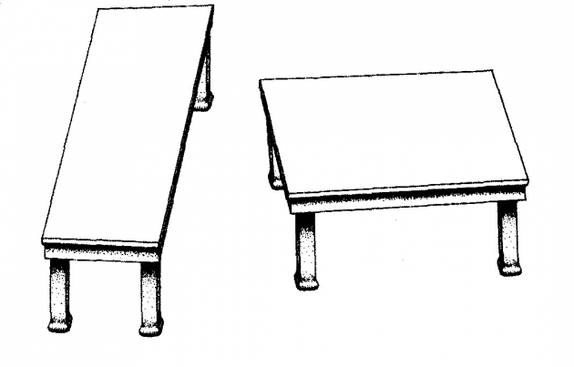

<blockquote>
	What do we have in mind when we use the word "perception"? What is perceptual constancy? Why do we adopt perceptual constancy phenomena as our test vehicles?  
	We present our standpoint through the lens of human visual perception.
</blockquote>

	<!-- place anchor a little above so that can reference there -->
    
	<header class="major">
	    <h4>Motivation</h4>
	</header>

	To be able to carry out meaningful research, it is important to pick insight-provoking phenomena. To draw a parallel, in Physics, an object by itself does not offer much incentive to be studied. In other words, if a system of interest is a ball, just by looking at the ball itself does not offer enough perspective for physicists to come up with brilliant guesses on the underlying laws of nature that are acting upon the ball. It is when the ball is set into motion that a perspective opened up, which led to the proposal of characterizing dynamics or motion of systems by energy and momentum. This may be why the field of mechanics is one of the oldest branches in physics. 

	Similarly, we need more perspectives to study perception. Can we play with perception as we would play with a ball? By manipulating perception, we hope to gain much insight to perception, much more than if we would study perception alone. This is because once we set perception "into motion," we can compare two percepts, and identify their <em>similarities</em>. From the set of similarities, there may be a subset, which define the fundamental ingredients that all percepts share. In other words, these fundamental ingredients, being common to all percepts, constitute the experience which we called percepts.

<header class="major">
    <h4>What is perception</h4>
</header>
Perception is the mental representation of physical properties. It is the subjective realization of the objective world (an individual’s the mental copy of the world out there). Perception is often classified as a low level cognitive function, but it is by no means easy! Common synonyms to perception include: mind, mental model, subjective experience, ... Therefore, research using any of those keywords are to our interest. Specifically, we ask: what is the governing law of perception? 

<header class="major">
    <h4>Perceptual constancies in everyday life</h4>
</header>
Perceptual constancy offers the best setup to study the intrinsic laws of perception. As we have discussed under section <a href="#sec:Motivation">Motivation</a>, if two percepts share similarities after some manipulations of the world, we are on our way to identifying the fundamental ingredients that constitute our percepts.  

This notion of starting with an invariance (preserved similarity even though a transformation has taken place) to derive the underlying law of nature is elegantly summarized by Noether's theorem (Refer to the page <a href="noetherTheorem.html">Noether's theorem</a> for full details). Noether's theorem has been widely used in physics to reveal the hidden laws of nature such as the conservation laws of energy and momentum. To apply Noether's theorem in our research, we need to define invariances or constancies which we observe in our daily lives. These invariances or constancies are also commonly referred to as <em>symmetries</em>.

An short list of perceptual constancy in everyday life (with a focus on visual perceptual constancy) is included below. 
- Shape constancy: the ability to label the shape as rectangular whether it is shown upright on a computer screen or lying flat on a table, slanted in depth
- Size constancy: the ability to attribute consistent size to the book regardless is placed on a table 2m away or held in hands 0.5m away
- Lightness constancy: the ability to distinguish a white object placed in a dark room as white while a black object placed under sunlight is black although the absolute light reflectance may not indicate so
- Color constancy: the ability to interpret a car as having the blue color whether it is parked under sunlight or moonlight
- Object constancy: the ability to tell that the car you saw in the side mirror is now the car in front of you
To summarize, perceptual constancy can be viewed as some transformations that humans are robust to, such that the arrived percept remains constant or invariant before and after some transformation. The more we can expand this list to include more perceptual constancies, the wider perspective we will be able to take on. 

<header class="major">
	<h4>Our stance</h4>
</header>

Our journey started with observation on invariance (symmetry) regarding some aspects of the world. We are inspired by the phenomena under the umbrella term of perceptual constancy, where some physical quantities are always perceived consistently regardless of time, space or some other transformations.

We focus on visual perception since it is the most dominant sensory perception in most cases for humans. Not only so, we have the deepest understanding in vision compared to other sensory modalities. 

In this project we will focus on 3D shape constancy. Why 3D shapes instead of simpler 2D shapes? We argue that human vision operates in 3D, with 2D shapes being a subset of all perceivable shapes. Not only so, 2D shapes are perceived by solving the visual problem in 3D, as suggested by the Shepherd table illusion \["Turning the Tables" Shepard, R. N. (1990)\]. 

However, 3D shape perception is an ill-posed inverse problem because human retina represents information only in 2D. To arrive at a unique perception at a higher dimension (3D) scene given a lower dimension 2D retinal image, human visual algorithm needs to select out of infinitely many possibilities, the one perception to arrive at. Not only so, all humans see things the same way, suggesting that all humans picked the same perceptual solution to be the one out of the infinite choices. There must be a law in nature that governs this process. 

The goal of this project is to identify the underlying law that allowed 3D shape perception to occur, a law general enough to guide all humans to arrive at the same perception. We believe we have the best chance of studying this law by following Noether's formulation: every invariance in nature is related to its conservation law through the least action principle. Refer to the <a href="brainstorm.html">Attempts</a> page for details of our proposal, as we outline the direction of research towards to identify the conservation law for visual perception.

<header class="major">
    <h4>Sidetrack: Impressive perceptual constancy</h4>
</header>
Perceptual constancy is impressive given that the physical system supporting and maintaining the constancy is dynamic and noisy &#8212; hundred thousand neurons die everyday and the brain is noisy. This is equivalent to training a neural net, applying dropout not only during training (i.e. accounting for apoptosis during learning) but also dropout during testing (i.e. accounting for dynamic changes when confronted with a problem). Of course, we are constantly learning and adjusting, so this may not be an apt example but to get the point across, it is really impressive.

